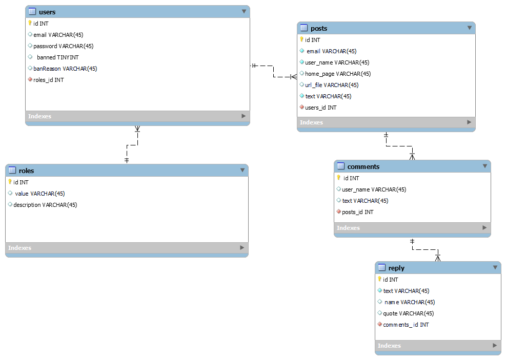

# SPA Приложение "Посты и комментарии"

## Описание проекта

Проект представляет собой одностраничное приложение (SPA) для добавления, отображения и управления комментариями пользователей. Приложение позволяет пользователям оставлять комментарии, которые сохраняются в реляционной базе данных PostgreSQL. Проект реализован с использованием архитектуры клиента-сервера с применением следующих технологий:

- **Backend**: NestJS, PostgreSQL, Sequelize, Docker
- **Frontend**: React, Material-UI, Axios
- **Аутентификация и защита**: JWT, bcryptjs
- **WebSocket**: Реализация в реальном времени

## Основные функции

### Пользовательский интерфейс

1. **Форма добавления постов**:
   - Поля формы: User Name, E-mail, Home page, CAPTCHA, Text
   - Проверка формата введенных данных (валидация email, URL, CAPTCHA)
   - Обработка и сохранение вложений (изображений и текстовых файлов)
2. **Добавление и отображение комментариев**:
   - Каскадное отображение комментариев (вложенные ответы)
   - Возможность сортировки комментариев по User Name и дате добавления (в обоих направлениях)
3. **Защита от XSS и SQL-инъекций**:
   - Валидация вводимых данных от недопустимых HTML-тегов
   - Защита запросов к базе данных с помощью параметризованных запросов

### Визуальные эффекты и улучшения

- Добавление файлов (изображения или текстового файла) с предварительной проверкой размеров и формата
- Панель инструментов для добавления HTML-тегов в текст поста
- Предпросмотр комментария перед отправкой без перезагрузки страницы

### Серверная часть

- Реализация API на NestJS для обработки CRUD-операций с комментариями
- Валидация данных на стороне сервера с использованием классов и декораторов
- Поддержка WebSocket для отображения новых комментариев и ответов на комментарии в реальном времени
- Обработка размера изображений с использованием библиотеки Sharp

### Клиентская часть

- Реализация интерфейса на React с использованием Material-UI для создания форм и отображения комментариев
- Валидация данных на стороне клиента с использованием библиотеки Yup и React Hook Form
- Обработка асинхронных запросов к API с помощью Axios

## Технические требования

- **Git**: Версионный контроль и ветвление для отслеживания изменений
- **Docker**: Упаковка приложения в контейнер для простоты развертывания
- **ORM**: Sequelize для работы с базой данных PostgreSQL
- **WebSocket**: Реализация взаимодействия в реальном времени

## Установка и запуск

### Предварительные требования

- Docker
- Node.js

### Шаги для установки и запуска

1. Клонируйте репозиторий:

   ```bash
   git clone https://github.com/sergey-uhanov/forum-DzenCOde
   ```

2. Перейдите в директорию проекта:

   ```bash
   cd ../forum-DzenCOde
   ```

3. Запустите контейнеры Docker:

   ```bash
   docker-compose up --build
   ```

4. Приложение будет доступно по адресу:
   ```plaintext
   http://localhost:3001
   ```

## Структура проекта

- `server/` - Серверная часть проекта на NestJS
- `client/` - Клиентская часть проекта на React
- `docker-compose.yml` - Конфигурация Docker для развертывания контейнеров
- `README.md` - Описание проекта и инструкция по установке
- `schema.mwb` - Схема базы данных

## Схема базы данных



Проект разработан с целью демонстрации навыков разработки SPA-приложений с использованием современных технологий.
